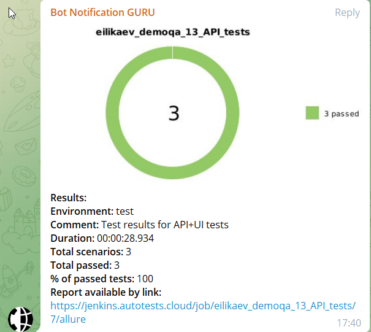
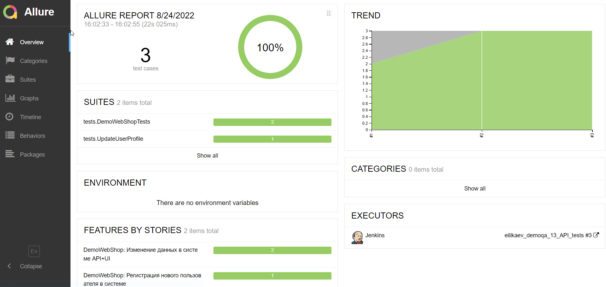
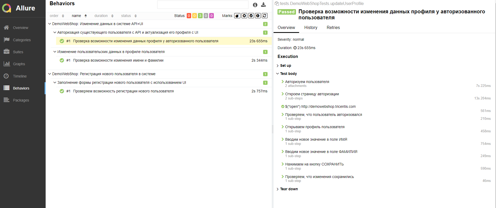
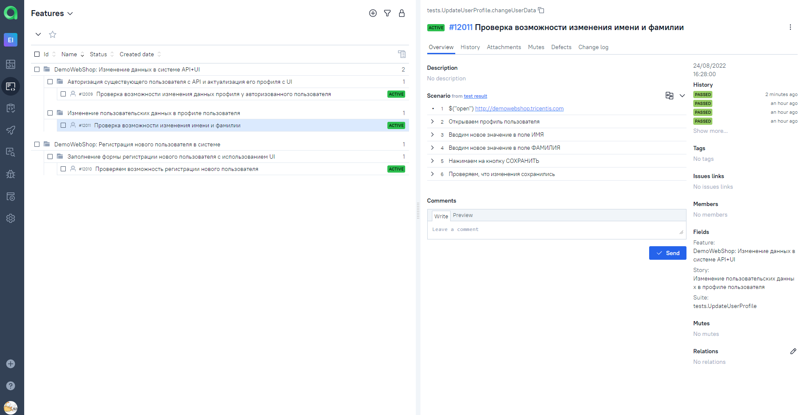
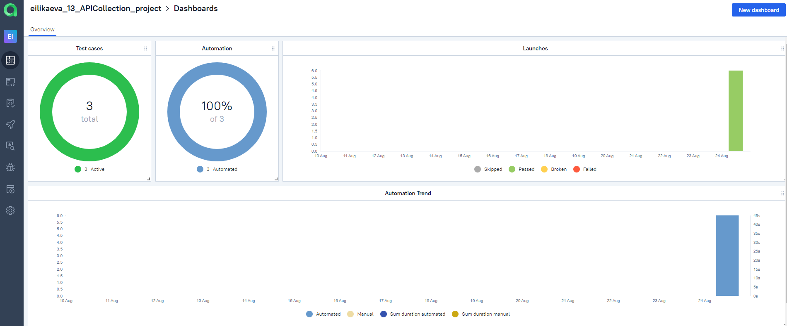
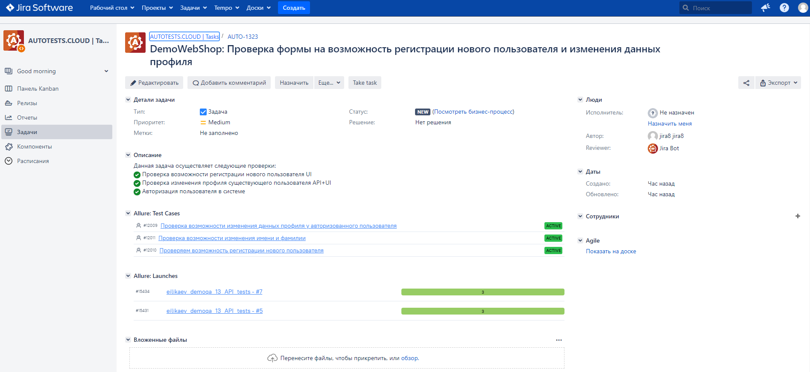

# Автоматизация тестирования веб-приложения с использованием библиотеки REST-assured 

# <a name="Содержание">Содержание:</a>

+ [Используемые технологии](#ИспользуемыеТехнологии)
+ [Реализация проверок](#РеализацияПроверок)
+ [Запуск тестов из Jenkins](#ЗапускТестовИзJenkins)
+ [Оповещение в Telegram](#ОповещениеВTelegram)
+ [Отчет о результатах прохождения тестов в Allure Report](#ОтчетОРезультатахПрохожденияТестовВAllureReport)
+ [Интеграция с Allure TestOps](#ИнтеграцияСAllureTestOps)
    + [Список тестовых случаев в проекте](#СписокТестовыхСлучаевВПроекте)
    + [Dashboards](#Dashboards)
+ [Интеграция с Jira](#ИнтеграцияСJira)


# <a name="ИспользуемыеТехнологии">Используемые технологии</a>

<p align="center">


</p>

# <a name="РеализацияПроверок">Реализация проверок</a>

> Авторизация пользователя в системе
> 
> Проверка возможности регистрации нового пользователя UI
> 
> Проверка изменения профиля существующего пользователя API+UI


## <a name="ЗапускТестовИзJenkins">Запуск тестов из Jenkins</a>

```bash
clean test
```
# <a name="ОповещениеВTelegram">Оповещение в Telegram</a>

Отправка уведомлений о результатах прохождения тестов осуществляется с помощью Telegram бота.

<p  align="center">

</p>


# <a name="ОтчетОРезультатахПрохожденияТестовВAllureReport">Отчет о результатах прохождения тестов в Allure Report</a>


<p  align="center">

</p>

<p  align="center">

</p>

# <a name="ИнтеграцияСAllureTestOps">Интеграция с Allure TestOps</a>

Allure TestOps предоставляет возможность командам создавать тестовую документацию, хранить,
запускать и анализировать ручные и автоматические тесты в одном месте и в режиме реального времени.

## <a name="СписокТестовыхСлучаевВПроекте">Список тестовых случаев в проекте</a>

<p  align="center">

</p>

## <a name="Dashboards">Dashboards</a>

Отслеживание хода выполнения тестирования в Allure TestOps:
<p  align="center">

</p>

# <a name="ИнтеграцияСJira">Интеграция с Jira</a>
Интеграция с Jira позволяет отследить результаты прохождения тестов. 

<p  align="center">

</p>